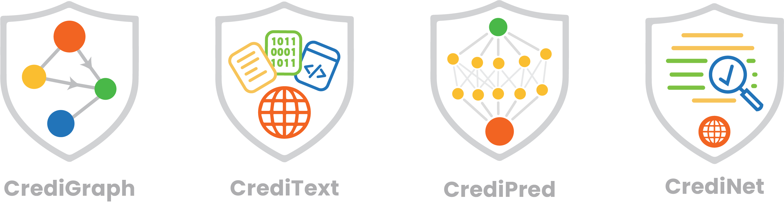

<div align="center">

## CrediNet: <br> Network-Based Credibility Modelling


### About CrediNet

**CrediNet** is a set of tools that use graph machine learning and computational methods for credibility modelling on the web.

We develop billion-scale data webgraphs and use them to assess credibility levels of websites, which can be used downstream to augment Retrieval-Augmented Generation robustness and fact-checking. 
This involves large-scale web scraping and text processing, and developing model architectures to interpret the different types of signals we can find on the web (including structural, temporal and linguistic cues). 

See also our [Huggingface datasets](https://huggingface.co/credi-net).

</div>

---


For more details, refer to a specific repository: 
<!-- <div align="center"> -->

<!-- </div> -->

- [CrediNet](https://github.com/credi-net/CrediNet): the client-side repository with the API documentation, and downstream application examples.
- [CrediPred](https://github.com/credi-net/CrediPred): our graph-based models, trained for the task of predicting the assessed credibility level of a given domain on the web.
- [CrediGraph](https://github.com/credi-net/CrediGraph): our data construction pipeline, including:
  - The graph construction pipeline which automates the generation of billion-scale graphs from Common Crawl's raw data files on a monthly basis; and
  - A benchmark curation of 600k+ labeled domains from 8 human-annotated datasets of credibility scores, spanning both continuous and binary domain labels.
- [CrediText](https://github.com/credi-net/CrediText): the text extraction pipeline, which retrieves text content for the millions of nodes in our graph datasets, either from Common Crawl raw files or through web scraping. This text is used to augment the structural and temporal information found in the graph in learning credibility signals.


## Contribution Guidelines
## Prerequisites

The project uses [uv](https://docs.astral.sh/uv/) to manage and lock project dependencies for a consistent and reproducible environment. If you do not have `uv` installed on your system, visit [this page](https://docs.astral.sh/uv/getting-started/installation/) for installation instructions.

**Note**: If you have `pip` installed globally you can just invoke:

```sh
pip install uv
```

### Using uv

#### Background

_uv_ manages a lockfile which maintains a consistent and fixed dependency graph for all _CrediGraph_ dependencies. These dependencies are bundled in a python virtual environment stored in a hidden `.venv` folder in the root project directory. The virtual environment is generated on the fly based on the lockfile and is created upon calling `uv sync`.

#### Running commands

_uv_ bundles all dependencies (including Python itself) into the virtual environment. Most commands can be run by simply prepending `uv run`
to the respective command.

For example:

- Instead of running `python <command>`, you will run `uv run python <command>`
- Instead of running `pytest`, you will run `uv run pytest`

#### Adding and Removing Dependencies

_uv_ has a package resolver which will automatically resolve all packages to their most recent version at the time of installation while respecting the current dependencies.

To add or remove a _core_ dependency, issue `uv add <package>` and `uv remove <package>`, respectively. For instance, to add `numpy` as a core dependency, we would issue:

```sh
uv add numpy
```

**Note**: this will automatically update the [pyproject.toml](../pyproject.toml) and [uv lock file](../uv.lock) with the new package which will be reflected in version control.

In order to facilitate modularity and avoid burdening users with dependencies they don't need, it's recommended to minimize core dependencies to those that **all** users will require for **every** release. To support this, _uv_ has the notion of _dependency groups_, which facilitate auxilary dependencies. For instance, the _dev_ group is the set of dependencies required for _CrediGraph_ development, but is not necessarily shipped to end-users of the library.

To add or remove a package from a dependency group, issue `uv add --<group> <package>` and `uv remove --<group> <package>`, respectively. For instance, to add `hypothesis` as a `dev` dependancy, we would issue:

```sh
uv add --dev hypothesis
```

Note, that auxilary dependency groups can be synced by running `uv sync --group <group name>`.

In general, any wheels published on [pypi](https://pypi.org/) can be directly added, making _uv_ a drop-in replacement for _pip_. For more complex use cases such as non-python dependencies, or installing specific package versions, consult the [uv documentation](https://docs.astral.sh/uv/).

#### Activating the virtual environment

Sometimes you will want to activate the virtual environment manually in order to access the dependencies explicitly (for instance, for integration with a language server for code completion). The virtual environment can be activated by invoking the appropriate activation file, dependencing on your shell. For instance, for _bash_, you can issue:

```sh
. .venv/bin/activate
```

to activate the environment.

**Note**: after doing so, you will have direct access to all executables (e.g. Python) as usual.

## Dev Installation

#### From Source

```sh
# Clone the repo

#CD into repo. e.x:
cd CrediText

# Install core dependencies into an isolated environment
uv sync
```

### Install pre-commit hooks:

Credi-Net projects ship with a set of [pre-commit hooks](../.pre-commit-config.yaml) that automatically apply code formatting, linting, static type analysis, and more.

The hooks can be installed by issuing:

```sh
uv run pre-commit install
```

It is recommended to use these hooks when committing code remotely, but they can also be skipped by commiting with the `--no-verify` flag.

## Unit Testing

Each repo has a test suite that are located under `test/`.
Run the entire (unit) test suite with

```sh
uv run pytest test/
```

## Continuous Integration

Credi-net repositories use Github Actions to maintain code under our standards. Your PR will be checked against our workflows. 

# Resources
Read more on this work:
- Pre-print on the graph construction and preliminary model results (ArXiv): [*CrediBench: Building Web-Scale Network Datasets for Information Integrity*](https://arxiv.org/abs/2509.23340)
- See also [CrediNet on HuggingFace](https://huggingface.co/credi-net)
  
or our work more broadly at the [Complex Data Lab](https://huggingface.co/ComplexDataLab).

For more documentation regarding the CrediNet codebase, refer to README's under individual repositories. 
 
